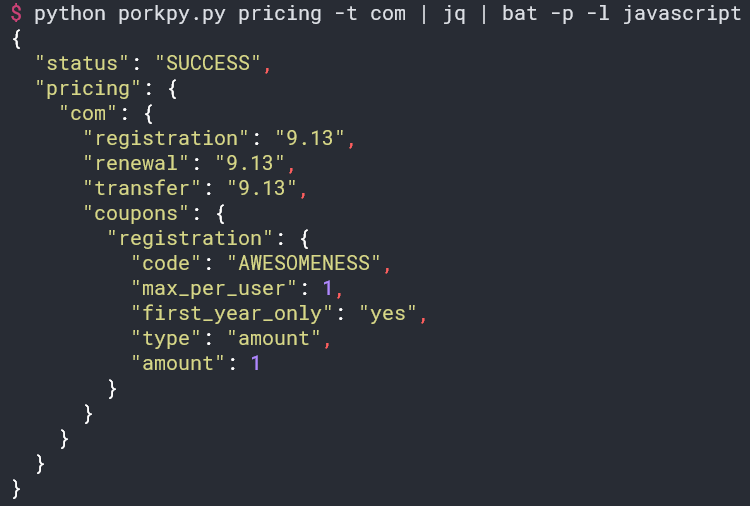

# Porkpy 🐷 - CLI App to Interact With the Porkbun DNS API

**It really cooks the bacon.**

Easily manage your DNS records from the command line.

## Features

* Check prices for all available TLDs.
* Check the price for any number of specific TLDs.
* Test your API keys to make sure they work.
* View records for an authorized domain.
* Create new records for an authorized domain.
* Delete records.
* **Currently unusable, please use the Porkbun web interface to edit a record.** Edit records.

## Usage

Currently Porkpy is developed and managed with [Poetry](https://python-poetry.org/).

- Install Poetry
- Clone this repo
- In the directory where you have cloned this repo use `poetry install` to setup your environment.
- Use `poetry run python porkpy.py <commands>` to use Porkpy.

## Roadmap

- Better testing, with full automation.
- Provide docker image as well as executables.
- Refactor, refactor, refactor.

